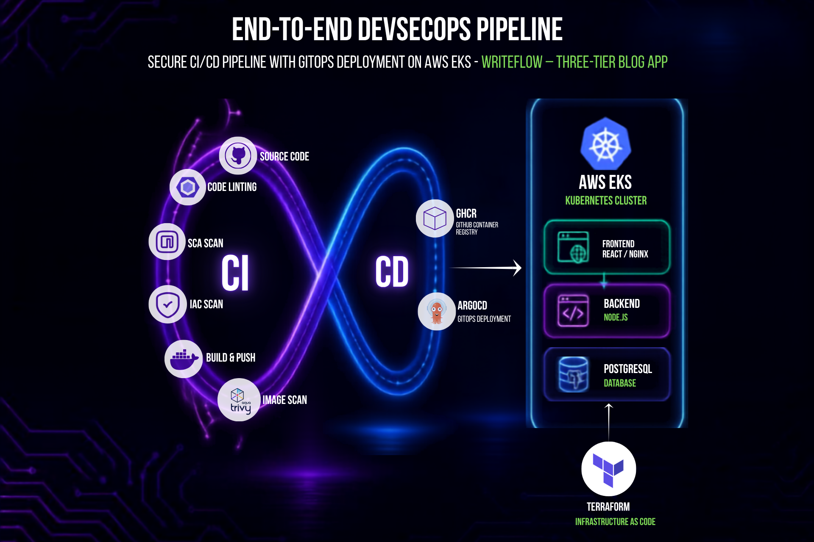

# 🛤️ Writeflow — Blog Platform & DevSecOps Showcase

A full-stack blog platform built with a 3-tier architecture — React frontend, Node.js backend, and PostgreSQL database — fully equipped with modern DevSecOps practices including Docker, Kubernetes (EKS), Terraform, and GitHub Actions CI/CD.


---

## 📊 Overview Diagram



---

## ✨ Features

- 📝 Create blog posts with emoji vibes
- ✏️ Edit your existing posts
- 🗑️ Delete posts you're not feeling anymore
- 💬 Comment on posts
- 🎨 Dark UI with glassmorphism and modern gradients
- 🔒 DevSecOps pipeline with automated security scanning (Trivy, Checkov, Hadolint)

---

## 🏗️ Architecture

```text
┌──────────────┐     ┌──────────────┐     ┌──────────────┐
│   Frontend   │────▶│   Backend    │────▶│  PostgreSQL   │
│   (React +   │◀────│  (Node.js +  │◀────│              │
│    Nginx)    │     │   Express)   │     │              │
│  Port 80/8080│     │  Port 5000   │     │  Port 5432   │
└──────────────┘     └──────────────┘     └──────────────┘
```

---

## 📁 Project Structure

```text
Writeflow/
├── frontend/                # React (Vite) frontend with Nginx & Dockerfile
├── backend/                 # Node.js Express API & PostgreSQL connection
├── k8s/                     # Kubernetes manifests (Deployments, Services, ConfigMaps, Secrets)
├── terraform/               # Terraform IaC for AWS EKS (Auto Mode) & VPC
├── deploy/                  # EC2 bare-metal deployment scripts
│   ├── setup.sh             # One-click EC2 setup script
│   └── writeflow-nginx.conf    # Nginx reverse proxy configuration
├── docker-compose.yml       # Local multi-container Docker setup
└── .github/workflows/
    └── ci-cd.yml            # Automated CI/CD pipeline with security scans
```

---

## 🐳 Quickstart with Docker Compose

Run the complete stack (Frontend, Backend, and PostgreSQL) locally with Docker Compose:

```bash
docker compose up --build -d
```

- **Frontend**: http://localhost
- **Backend API**: http://localhost:5000
- **Stop containers**: `docker compose down`

---

## 🧑‍💻 Local Development (Without Docker)

### Prerequisites

- Node.js 20+
- PostgreSQL 16+

### Backend

```bash
cd backend
npm install

# Set environment variables
export DB_HOST=localhost
export DB_PORT=5432
export DB_USER=writeflow_user
export DB_PASSWORD=writeflow_pass_2026
export DB_NAME=writeflow_db
export PORT=5000

npm start
```

### Frontend

```bash
cd frontend
npm install
npm run dev
```

The Vite dev server starts on `http://localhost:3000` and proxies `/api` requests to the backend at `http://localhost:5000`.

---

## ☸️ Kubernetes Deployment

The Kubernetes manifests in `k8s/writeflow.yaml` define the full application deployment:

```bash
kubectl apply -f k8s/writeflow.yaml
```

To view pods and services:

```bash
kubectl get pods -n writeflow
kubectl get svc -n writeflow
```

---

## 🏗️ Infrastructure with Terraform (AWS EKS)

Provisions a production-grade VPC and AWS EKS cluster with Auto Mode:

```bash
cd terraform
terraform init
terraform plan
terraform apply
```

---

## 🚀 Deploy on AWS EC2 (Bare Metal)

### Prerequisites

- An AWS EC2 instance running **Ubuntu 22.04+**
- Security Group allowing inbound traffic on ports **22** (SSH) and **80** (HTTP)

### Steps

```bash
# 1. Transfer the repository to your EC2 instance
scp -r -i your-key.pem ./Writeflow ubuntu@<EC2_PUBLIC_IP>:~/Writeflow

# 2. SSH into your instance
ssh -i your-key.pem ubuntu@<EC2_PUBLIC_IP>

# 3. Run the automated setup script
cd ~/Writeflow
chmod +x deploy/setup.sh
./deploy/setup.sh
```

---

## 📡 API Endpoints

| Method | Endpoint | Description |
|---|---|---|
| GET | `/api/health` | Health check |
| GET | `/api/posts` | Get all posts |
| GET | `/api/posts/:id` | Get single post with comments |
| POST | `/api/posts` | Create a new post |
| PUT | `/api/posts/:id` | Update a post |
| DELETE | `/api/posts/:id` | Delete a post |
| GET | `/api/comments/post/:postId` | Get comments for a post |
| POST | `/api/comments` | Create a comment |
| DELETE | `/api/comments/:id` | Delete a comment |

---

## 🛡️ DevSecOps CI/CD Pipeline

The GitHub Actions workflow (`.github/workflows/ci-cd.yml`) performs:

1. **Linting**: Code quality checks for backend and frontend.
2. **SCA**: Dependency audit using `npm audit`.
3. **Build**: Multi-stage Docker container builds.
4. **Container Scan**: Vulnerability scanning via Aquasecurity Trivy.
5. **IaC Scan**: Infrastructure security scanning via Bridgecrew Checkov (Terraform & Kubernetes).
6. **Dockerfile Lint**: Best practices check via Hadolint.
7. **GitOps Manifest Update**: Automatically updates container image tags in `k8s/writeflow.yaml` on push to `main`.
